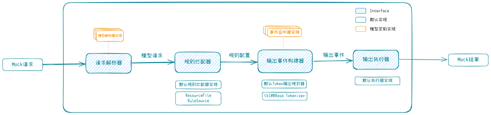

# LLM-Mocker 
用于Java 开发的大语言模型API mock工具，通过配置匹配规则返回内容，用于在开发及CI环境提供稳定的大模型API

供应商支持计划:
* [ ] OpenAI 
* [ ] Azure OpenAI
* [ ] Claude
* [ ] ChatGLM
* [ ] 文心一言
* [ ] 更多(欢迎提交PR)

配置管理支持：

* [ ] Resource 配置文件
* [ ] 本地配置目录
* [ ] 在线配置

启动方式支持计划：

* [ ] Java Jar 本地
* [ ] 原生二进制
* [ ] Docker/k8s
* [ ] JUnit Test Plugin

## 实现方案

1. 业务流程

